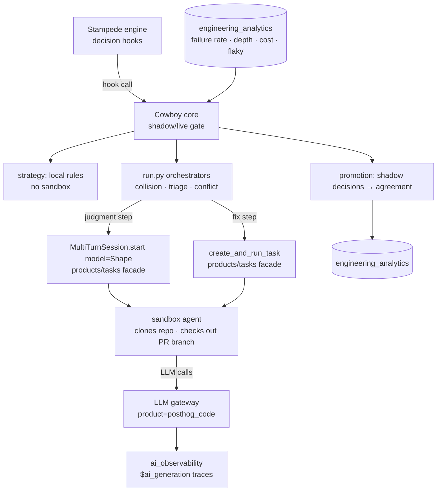

# Cowboy — engineering RFC

> Engineering design for the AI orchestrator described in the product RFC
> ([`merge-queue-design.md`](./merge-queue-design.md)). Cowboy sits _above_ the Stampede engine
> ([`stampede-engineering-rfc.md`](./stampede-engineering-rfc.md)) and makes the judgment calls a human
> merge-wrangler makes today. That doc owns the _what_; this owns the _how_.
>
> **Cowboy is built on the ReviewHog template** (`products/review_hog/`, [PR #64651](https://github.com/PostHog/posthog/pull/64651)).
> ReviewHog is PostHog's automated PR reviewer, and it established the pattern we follow: a Django app
> that **never calls an LLM SDK directly**, runs every LLM step inside a **sandbox agent** spawned
> through `products/tasks`, structures each step as a versioned jinja prompt + JSON schema parsed into a
> validated model, and orchestrates with an idempotent, resumable, semaphore-throttled async pipeline
> that fans out with `asyncio.gather` and validates its own findings with a second agent. Cowboy is the
> same machine pointed at merge decisions instead of review comments.

## 1. Scope

Cowboy implements the four decision hooks the engine exposes (Stampede RFC §4.2):
`select_strategy`, `predict_collision`, `on_conflict`, `triage_ejection`. Each is a discrete,
independently-promotable decision.

**Hard boundaries:**

- Cowboy depends on the engine, never the reverse. It imports `products/merge_queue/backend/facade/api.py`
  and nothing deeper. The engine runs fully without it.
- Cowboy can do everything the engine lets it (act on the queue) **except** break-glass, which the
  facade rejects for agent/Cowboy actors (Stampede RFC §14).
- Every Cowboy decision is still gated by a full-suite trial before anything merges. A wrong call costs
  CI time or throughput, **never** correctness — the property that makes per-decision shadow→live
  promotion safe.

## 2. Where it lives — the ReviewHog layout

A package inside the merge-queue product (kept separate so the dependency stays one-way), structured
internally exactly like ReviewHog's `reviewer/`:

```text
products/merge_queue/cowboy/
├── run.py                 # per-decision orchestrators (idempotent, asyncio.gather, semaphore)
├── core.py                # decision router: hook call → orchestrator, shadow/live gate
├── models/                # pydantic models + generate_all_schemas()  (mirrors reviewer/models/)
│   ├── collision.py       #   CollisionPrediction, CollisionVerdict
│   ├── triage.py          #   EjectionDiagnosis, FixPlan
│   └── conflict.py        #   ConflictResolution
├── tools/                 # step implementations (mirrors reviewer/tools/)
│   ├── collision_detect.py
│   ├── collision_validate.py
│   ├── ejection_diagnose.py
│   ├── fix_dispatch.py
│   └── conflict_resolve.py
├── prompts/               # versioned jinja prompt + JSON schema per step (mirrors reviewer/prompts/)
│   ├── collision_detect/{prompt.jinja, schema.json}
│   ├── collision_validate/{prompt.jinja, schema.json}
│   └── ejection_diagnose/{prompt.jinja, schema.json}
├── sandbox/
│   └── executor.py        # run_sandbox_step() + the MAX_CONCURRENT_SANDBOXES semaphore
├── signals.py             # reads engineering_analytics: failure rate, queue depth, CI cost, flaky
├── promotion.py           # per-decision shadow→live state + agreement scoring
└── constants.py
```

This is ReviewHog's anatomy (`run.py` / `models/` / `tools/` / `prompts/<step>/{prompt.jinja,schema.json}`
/ `sandbox/executor.py` / `constants.py`) with the steps swapped from review passes to merge decisions.
The engine calls Cowboy through the decision hooks; Cowboy calls back into the engine only through the
public facade. No other product imports `cowboy/`.

### 2.1 What to reuse from ReviewHog vs. build new

Cowboy and ReviewHog share the _pattern_ and the _Tasks substrate_, not much domain logic — so most of
Cowboy is net-new, with a few concrete pieces worth lifting rather than rewriting:

- **Lift (extract to a shared helper, don't copy):** ReviewHog's PR-context plumbing
  (`tools/github_meta.py` — PR fetch/parse, comments, files, diffs) and its large-diff **chunking**
  (`tools/split_pr_into_chunks.py`), plus the sandbox-step wrapper (`sandbox/executor.py`'s
  `run_sandbox_review` + semaphore) and the JSON-extraction util. Cowboy's collision and diagnosis steps
  need exactly these. They're currently **private to `products/review_hog/`**, and the only sanctioned
  cross-product path is the Tasks facade — so reuse means a small refactor: factor a shared
  `sandbox-step` / `pr-context` helper that both products consume. Decide this up front (extract vs.
  accept duplication); it's cheap now and annoying later.
- **Copy the convention, not the content:** the jinja-prompt + `schema.json` → validated-model layout,
  the idempotent/resumable orchestrator, and the detect→validate-with-a-second-agent idiom (§6). Same
  shapes, different prompts.
- **Build new (no ReviewHog analogue):** everything stateful and live — the decision-hook wiring,
  shadow→live promotion (`promotion.py`), live-signal reads (`signals.py`), strategy selection (no LLM),
  cross-PR collision reasoning (ReviewHog reviews one PR in isolation), and the code-writing/re-enroll
  actions. ReviewHog is a one-shot batch run whose only side effect is posting comments; Cowboy is a
  control loop that mutates merge state. Don't try to force these onto ReviewHog's shape.

## 3. Architecture



**Cowboy never calls an LLM SDK or the gateway directly** — same as ReviewHog. All LLM work runs inside
a `products/tasks` sandbox agent, and the gateway sits _underneath_ the agent (the agent-server makes
its model calls through the gateway under the `posthog_code` product). So Cowboy inherits provider
abstraction, the Bedrock circuit-breaker fallback, the per-product cost ceiling, and automatic
`$ai_generation`/`ai_observability` tracing **for free, transitively** — no gateway integration to
build, no new gateway product to register, and LLM spend rides the existing PostHog Code budget rather
than a new contract (product RFC §Cost).

## 4. How Cowboy runs an LLM step

Two primitives, both from the sanctioned Tasks facade `products.tasks.backend.facade.agents` /
`products.tasks.backend.facade.api` (the only cross-product path, enforced by `tach check` — exactly as
ReviewHog binds to it):

**4.1 Structured judgment — `MultiTurnSession`.** For a decision that reads context and returns a
verdict (collision prediction, ejection diagnosis, conflict-resolvability), Cowboy spawns a fresh
single-turn sandbox session, following ReviewHog's `run_sandbox_review` helper:

```python
from products.tasks.backend.facade.agents import MultiTurnSession, CustomPromptSandboxContext

context = CustomPromptSandboxContext(team_id=team.id, user_id=cowboy_user.id, repository=pr.repo)
session, verdict = await MultiTurnSession.start(
    prompt=rendered_prompt,        # jinja template from cowboy/prompts/<step>/prompt.jinja
    context=context,               # sandbox clones the repo + checks out the PR branch
    model=CollisionVerdict,        # pydantic model; start() runs extract_json + model_validate internally
)
await session.end()                # single-turn: must end explicitly (ReviewHog's note)
```

The sandbox checking out the **real PR branch** is the point: a collision or diagnosis step can read the
actual code around a change — callers of a touched interface, the migration it adds — not just a diff in
a context window. That is strictly more powerful than a gateway-only call, and is why we accept the
sandbox cost (ReviewHog's "isolation over reuse" tradeoff). `MAX_CONCURRENT_SANDBOXES` in
`sandbox/executor.py` throttles all of it with one module-level semaphore.

**4.2 Autonomous fix work — `create_and_run_task`.** For a decision that writes code (fast-fix, agent
dispatch), Cowboy dispatches a full PostHog Code agent run (§7.1).

Every judgment step is **idempotent and resumable** (skip if its output artifact exists) so a failed
decision run resumes, just like ReviewHog's pipeline.

## 5. Strategy selection (no sandbox)

The one decision with no LLM. For an `auto` partition, `core.py` picks strategy + knobs (speculation
depth, batch size) from numeric live signals read via `signals.py` from `engineering_analytics`:
partition failure rate, queue depth, CI cost, what's enrolled. Rules, not a model — the inputs are
numbers and the policy must stay legible (failure rate climbing → collapse depth toward serial; deep
green queue → widen). A pinned partition never asks Cowboy. Re-evaluated on queue-state changes, not
per-PR.

## 6. Collision prediction (ReviewHog's detect → validate shape)

`run.py`'s collision orchestrator mirrors ReviewHog's _review → dedupe → validate-with-a-second-agent_
rigor, two-tier to bound cost:

1. **Static pass (local, no sandbox):** overlapping changed paths, touched symbols, migration
   collisions, shared partition scopes — computed off Stampede's affected-target graph
   (`ci/affected_targets.py`). Resolves the clear-cut majority.
2. **Semantic detect (`tools/collision_detect.py`, sandbox):** only when the static pass is inconclusive
   _and_ the surface is high-risk. A sandbox agent with both PR branches checked out predicts whether
   they collide — catching what file overlap misses (an interface change and its callers).
3. **Adversarial validate (`tools/collision_validate.py`, sandbox):** a _second_ agent tries to refute a
   predicted collision before Cowboy acts on it — the same "validate every finding with another agent"
   step that makes ReviewHog's output trustworthy. Only confirmed collisions feed strategy/ordering.

The gate (`static inconclusive ∧ high-risk`) keeps sandbox spend on the ambiguous minority. A predicted
collision shapes strategy/ordering (don't speculate two colliding PRs concurrently); it never blocks a
merge on its own — the trial remains the arbiter.

## 7. Conflict handling & ejection triage (the code-writing decisions)

These write code, so they earn live promotion **last** (product RFC §Shadow mode), and they reuse
ReviewHog's exact dispatch substrate.

**`on_conflict` (`tools/conflict_resolve.py`).** When a PR no longer merges cleanly into the state ahead
of it, a judgment step (4.1) assesses whether the resolution is mechanical. If yes → an agent rebases in
place (4.2); if not → eject to author/agent. A rebased PR re-validates against its target state before
merging, like every other write.

**`triage_ejection` (collision orchestrator's sibling in `run.py`).** On ejection:

1. **Flaky split (local):** read the flaky verdict via `signals.py` (Mendral today →
   `engineering_analytics` flaky signal; Stampede RFC §13). Flaky victims re-queue silently; only a
   genuine failure is charged to the PR.
2. **Diagnose (`tools/ejection_diagnose.py`, sandbox):** an agent with the PR branch and the failing
   trial output produces a structured `EjectionDiagnosis` (root cause, confidence, proposed `FixPlan`).
3. **Fast-fix vs dispatch:** a high-confidence diagnosis _with_ a mechanical `FixPlan` is applied in
   place; otherwise dispatch the brief (§7.1). On low confidence, dispatch just the failure.
4. **Cycle cap:** a configurable per-PR cap breaks loops and escalates fast-fix → agent → human.
   Enforced in `core.py`, counted in `promotion.py`.

### 7.1 Agent dispatch — `create_and_run_task`

The fix loop hands work to the existing PostHog Code agent through the Tasks facade — the same
infrastructure ReviewHog uses, no new agent runtime:

```python
from products.tasks.backend.facade import api as tasks_api

created = tasks_api.create_and_run_task(
    team=team,
    title=f"[Cowboy] Fix ejected PR #{pr.number}",
    description=fix_brief,            # rendered from the EjectionDiagnosis + FixPlan
    origin_product="automation",      # Task.OriginProduct
    repository=pr.repo,
    create_pr=False,                  # push to the existing PR branch, don't open a new PR
    mode="background",
    posthog_mcp_scopes="full",
)
```

The agent fixes in-sandbox (Docker local / Modal+gVisor prod), pushes to the PR branch under a per-agent
bot identity (Stampede RFC §11), and the PR re-enters the queue under its **existing approval** with no
fresh review (product RFC §Cowboy). This same path backs the engine's `diagnose_ejection` MCP tool: an
agent watching its own PR calls `diagnose_ejection` → gets Cowboy's brief → fixes → re-enrolls. Run
status is polled/streamed from the `TaskRun`; the cycle cap bounds retries.

## 8. Shadow → live promotion

Each decision type promotes on its own evidence. `promotion.py` holds per-decision state
(`shadow | live`) and the agreement scoring that justifies a flip.

- In **shadow**, the engine takes Cowboy's decision through the hook but acts on the deterministic
  default, recording both via Stampede's `observability.py` (Stampede RFC §4.2). Cowboy computes real
  decisions against real PRs — spawning real sandboxes, paying real cost — but touches nothing.
- Agreement is scored against what actually happened (did the human/default match Cowboy? did the trial
  vindicate Cowboy's collision/strategy call?).
- A decision flips to **live** once agreement holds. Order is intentional: `select_strategy` and
  `predict_collision` first (a wrong call only burns CI/throughput), then `on_conflict`, then
  `triage_ejection` last. Per-decision promotion means we can run strategy live while still shadowing
  triage, with no correctness risk at any point.

## 9. Access control

Cowboy operates under the same access model as any other agent (Stampede RFC §14): it may act on the
queue because that's the job, and it can **never** call `break_glass` — the facade rejects it by actor
type. Dispatched fix agents act under per-agent bot identities with normal repo access; nothing Cowboy
does escalates privilege.

## 10. Observability

Two streams, both inherited rather than built:

- **LLM traces & cost** — because every step runs through a Tasks sandbox agent and the agent calls the
  gateway, each lands as a `$ai_generation` event in `ai_observability` automatically, attributable to
  the PostHog Code product. Sandbox runs are also visible as `TaskRun`s in the Tasks UI (ReviewHog
  leans on the same).
- **Decisions & outcomes** — shadow/live decisions, agreement scores, cycle-cap escalations, fast-fix
  vs dispatch rates, auto-recovery rate flow through Stampede's `observability.py` into
  `engineering_analytics`, feeding the product-RFC success metrics.

Optionally Cowboy emits a **Signals** finding (`signals-scout-emit-signal` / `emit_signal()`) on a
systemic pattern — a partition whose failure rate keeps forcing speculation down, a recurring collision
class — surfacing it to the owning team's inbox.

## 11. Bounds & cost

- **LLM spend** is capped by the gateway's `posthog_code` product limits (transitively, §3) and gated to
  the ambiguous high-risk minority for the semantic collision pass (§6); strategy uses no LLM (§5).
- **Sandbox concurrency** is bounded by `MAX_CONCURRENT_SANDBOXES` (ReviewHog's semaphore pattern).
- **Fix loops** are bounded by the cycle cap, escalating fast-fix → agent → human (§7).
- **Cost is dominated by the CI Cowboy triggers** (which the engine bounds), not its own sandbox/LLM
  spend, both independently capped.

## 12. Milestones

Cowboy is milestone 7 of the product RFC, sequenced so the safe decisions ship first:

1. **Scaffold on the ReviewHog template** — `core.py`, `run.py`, `sandbox/executor.py` (semaphore),
   `models/` + `generate_all_schemas()`, `signals.py`, `promotion.py`, shadow-harness wiring. Everything
   starts in shadow.
2. **Strategy selection** — local rules over live signals; first to promote live (no sandbox).
3. **Collision prediction** — static pass → semantic detect → adversarial validate (the detect/validate
   sandbox steps); promote live.
4. **Conflict handling** — resolvability judgment + in-place rebase; promote live.
5. **Ejection triage + fix loop** — flaky split, diagnose step, fast-fix, `create_and_run_task` dispatch,
   cycle cap; promoted last.
6. **(later, as in ReviewHog)** — lift `run.py` into a **parent Temporal workflow** spawning each step as
   a child workflow for durable, visualizable decision runs (ReviewHog's stated next step:
   _"Make it a parent workflow and spawn steps as child workflows"_).

## 13. Risks & open questions

- **Fast-fix/agent merges that are green but wrong** (product RFC §Risks). Mitigation: code-writing
  decisions promote last and only after agreement holds; the full-suite trial gates every merge; the
  adversarial-validate step (§6) and cycle cap catch and bound errors.
- **Flaky-signal quality** drives the retry-vs-eject split; tied to the Mendral→`engineering_analytics`
  migration (Stampede RFC §13).
- **Sandbox latency on the hot path.** A judgment step spawns a sandbox (seconds–minutes), which sits in
  front of a trial for collision prediction. Mitigation: the static pass resolves the majority with no
  sandbox; the semantic pass is gated to the ambiguous minority; warm-sandbox reuse (Tasks `warm.py`) is
  an option if latency bites.
- **Outage of Tasks/sandbox or the gateway** takes Cowboy's LLM decisions offline; the engine falls back
  to deterministic defaults and ejections fall back to humans — degraded, not broken (§1 invariant).
- **Open:** confidence threshold separating fast-fix from dispatch — start conservative (almost
  everything dispatches), widen as agreement data justifies.
- **Open:** which model tier for each step, and the high-risk-surface definition gating the semantic
  pass — tune against shadow-mode false-positive/negative rates. (Model choice is per-step in the agent
  config, not a Cowboy concern beyond the prompt.)

## Appendix — integration points

| Need                                     | Reuse                                                                                           |
| ---------------------------------------- | ----------------------------------------------------------------------------------------------- |
| Template / architecture                  | **ReviewHog** (`products/review_hog/`, PR #64651) — same pipeline anatomy                       |
| Structured LLM judgment                  | `MultiTurnSession.start(model=Shape)` + `end()` — `products/tasks/backend/facade/agents.py`     |
| Autonomous code fixes                    | `create_and_run_task` — `products/tasks/backend/facade/api.py`                                  |
| Sandbox context                          | `CustomPromptSandboxContext(team_id, user_id, repository)` — clones repo + checks out PR branch |
| Sandbox runtime                          | `tasks` Docker/Modal sandbox (no new runtime)                                                   |
| LLM provider / cost ceiling / fallback   | LLM gateway **transitively**, via the agent (product `posthog_code`) — no direct integration    |
| LLM traces & cost observability          | `ai_observability` (`$ai_generation`, auto-captured through the agent)                          |
| Live signals (failure rate, depth, cost) | `engineering_analytics` facade / MCP (`workflow-health`, `pull-requests`)                       |
| Flaky verdict                            | Mendral today → `engineering_analytics` flaky signal                                            |
| Queue actions                            | Stampede `facade/api.py` (decision hooks + `enroll`/`dequeue`)                                  |
| Decision/outcome observability           | Stampede `observability.py` → `engineering_analytics`                                           |
| Systemic-pattern surfacing               | Signals (`signals-scout-emit-signal` / `emit_signal()`)                                         |
| Durable orchestration (later)            | Temporal parent workflow (ReviewHog's roadmap pattern)                                          |
