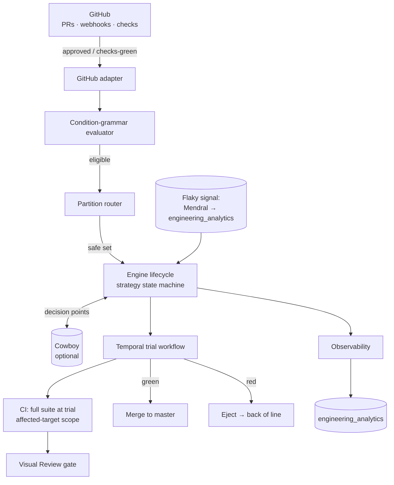

# Stampede — engineering RFC

> Engineering design for the merge-queue engine described in the product RFC
> ([`merge-queue-design.md`](./merge-queue-design.md)). That doc owns the _what_ and _why_; this one
> owns the _how_ — module layout, data model, the engine state machine, and how we land it on
> PostHog infra (Temporal, the GitHub integration, `engineering_analytics`, the MCP server, Signals,
> Visual Review). Cowboy, the AI orchestrator that sits above the engine, has its own doc
> ([`cowboy-engineering-rfc.md`](./cowboy-engineering-rfc.md)); the boundary between them is the
> engine API in §4.

## 1. Scope

Stampede is the deterministic part of the system: the queue engine that answers one narrow question
per trial — _"is this PR green against the state it will actually merge into?"_ — and the platform
plumbing around it (GitHub adapter, condition grammar, partition router, CI scoping, surfaces,
observability). Everything fuzzy (strategy selection for `auto` partitions, collision prediction,
conflict resolution, ejection triage, fix dispatch) lives in Cowboy and is explicitly **out of scope
here**. Stampede must be fully functional and safe with Cowboy turned off — Cowboy is an optimizer,
not a dependency.

**Non-negotiable invariant:** nothing merges that has not run the full CI suite against its projected
merged state and come back green. Every strategy, control, and surface in this doc preserves that.

## 2. Where it lives

A new PostHog product, following repo conventions (`products/<name>/backend`, `…/frontend`,
`…/mcp/tools.yaml`, `…/skills/`):

```text
products/merge_queue/
├── backend/
│   ├── models.py                 # Partition, Enrollment, Trial, QueueEvent (Postgres)
│   ├── engine/
│   │   ├── lifecycle.py          # enroll → trial → merge/eject state machine
│   │   ├── strategies/           # optimistic.py, serial.py, speculative.py, batched.py
│   │   ├── projected_state.py    # builds the ref a trial validates against
│   │   └── bisection.py          # O(log n) culprit isolation for batches
│   ├── grammar/
│   │   ├── parser.py             # fixed-keyword condition grammar
│   │   └── evaluator.py          # used by auto-enroll AND partition predicates
│   ├── router.py                 # partition matching → safe set
│   ├── ci/
│   │   ├── affected_targets.py   # changed files → build/test targets graph
│   │   └── scoping.py            # test-impact subset (open) vs full suite (trial)
│   ├── github/
│   │   ├── adapter.py            # webhooks in, merges/statuses out
│   │   └── bot_accounts.py       # per-agent bot identities
│   ├── temporal/                 # durable orchestration (mirrors products/tasks/backend/temporal)
│   │   ├── trial_workflow.py
│   │   └── queue_workflow.py
│   ├── facade/api.py             # the engine API (§4) — Cowboy's only entry point
│   ├── presentation/views.py     # DRF ViewSet → MCP tools + UI
│   └── observability.py          # emit lifecycle events to engineering_analytics
├── cowboy/                       # separate system, separate RFC; imports facade/api only
├── frontend/
├── mcp/tools.yaml
└── skills/
```

Stampede owns Postgres state (it is a stateful control plane, unlike `engineering_analytics` which is
read-only over the warehouse). Cowboy imports `products/merge_queue/backend/facade/api.py` and nothing
deeper; the engine never imports `cowboy/`. That one-way dependency is what lets the engine run
standalone and lets us shadow-test Cowboy against a live engine.

> **The data model and the full facade contract are locked in
> [`stampede-facade-and-data-model.md`](./stampede-facade-and-data-model.md)** — Postgres tables
> (`Partition`, `Enrollment`, `Slot`, `Trial`, `QueueEvent`) and the `facade/` signatures (imperative
> surface, decision hooks, deterministic defaults, the shadow/live gate). §2 and §4 here are the
> narrative; that doc is the build-to spec.

## 3. Architecture



The engine is driven by GitHub events on the way in and drives GitHub (merges, status checks) on the
way out. Temporal carries every long-running, must-not-drop operation (a trial spans minutes of CI;
the queue loop must survive deploys). At each decision point the engine asks Cowboy for a judgment if
Cowboy is live for that decision type; otherwise it falls back to the deterministic default (§4.3).

## 4. Engine API (the Stampede ↔ Cowboy boundary)

> Locked signatures (DTOs, exceptions, deterministic defaults, the `GatedProvider`) live in
> [`stampede-facade-and-data-model.md`](./stampede-facade-and-data-model.md) Part B. This section is the
> overview.

`facade/api.py` is the entire contract. Two halves:

**4.1 Imperative surface** (also backs the MCP tools and UI):

- `enroll(pr, *, actor) -> Enrollment` — admit an eligible PR; auto-called by the adapter, callable by humans/agents.
- `dequeue(pr, *, actor, reason)` — remove from queue.
- `status(pr) -> EnrollmentStatus` — position, current trial, projected state.
- `freeze(scope, *, actor)` / `unfreeze(scope, *, actor)` — pause/resume a partition or the whole queue.
- `break_glass(pr, *, actor)` — human-only forced merge; raises if `actor` is an agent or Cowboy.

**4.2 Decision hooks** — the engine calls these at each branch point. Each has a deterministic
default and an optional Cowboy override:

| Hook                               | Deterministic default (Cowboy off)           | Cowboy may override             |
| ---------------------------------- | -------------------------------------------- | ------------------------------- |
| `select_strategy(partition)`       | partition's pinned strategy; `auto` → serial | yes (live signals)              |
| `predict_collision(pr, projected)` | none (let the trial decide)                  | yes (static → semantic)         |
| `on_conflict(pr, target)`          | eject to author                              | yes (auto-rebase vs eject)      |
| `triage_ejection(trial)`           | flaky→retry, else eject to author            | yes (fast-fix / agent dispatch) |

When a hook is in **shadow** for Cowboy, the engine records Cowboy's would-be decision via
`observability.py` and acts on the deterministic default. This is how a decision type earns promotion
(see Cowboy RFC §8). Because every override is still gated by a full-suite trial before merge, a wrong
Cowboy call costs CI time or throughput, never correctness — which is what makes per-decision shadow
promotion safe.

## 5. Engine lifecycle & strategies

A PR moves through a state machine in `engine/lifecycle.py`:

```text
eligible → enrolled → trialing → (merged | ejected)
                          ↑__________________|  (re-enroll at back of line)
```

- **eligible** — the grammar evaluator passed (approved ∧ checks-green ∧ partition predicate).
- **enrolled** — holds a slot in its partition's ordered line; order is eligibility time.
- **trialing** — a Temporal `trial_workflow` is running the full suite against the PR's _projected
  state_ (§5.1).
- **merged** — green trial; the adapter fast-forwards/merges and posts the status check.
- **ejected** — red trial on a non-flaky test; re-enrolls at the **back** of the line (no head-of-line
  stall, bounded starvation — product RFC §Ordering).

### 5.1 Projected state

`projected_state.py` computes the git ref a trial validates against, which is the only thing that
differs between strategies:

| Strategy        | Projected state                                                 | Concurrency                     |
| --------------- | --------------------------------------------------------------- | ------------------------------- |
| **Optimistic**  | `master` HEAD                                                   | one trial, independent          |
| **Serial**      | `master` + the single predecessor ahead                         | one at a time, true merge order |
| **Speculative** | `master` + all in-flight predecessors up to _speculation depth_ | many concurrent                 |
| **Batched**     | `master` + the batch assembled together                         | one trial per batch             |

Speculative and batched are the milestone-5/6 work. The speculative engine maintains a chain of
projected refs; when a PR fails its trial, the **invalidation cascade** re-validates everything behind
it in the chain (bounded by depth, product RFC §Bounds). Batches are assembled scope-aware via the
affected-target graph; on a batch failure `bisection.py` isolates the culprit in `O(log n)` extra
trials and keeps the innocents.

### 5.2 Why we can re-run the full suite every trial

Test-impact selection (§7) runs _only_ while a PR is open. At trial we always run the full suite with
no selection, so no subset has to be certified "safe in isolation" and a thin or stale subset ejects
in the worst case rather than escaping. This is the single most important correctness property and it
is enforced in `ci/scoping.py`, not left to configuration.

## 6. Condition grammar

One small grammar, two consumers: auto-enroll gating and partition predicates. Fixed keywords only
(`approved`, `checks-green`, `files~=<glob>`, `label=<name>`, implicit `AND`, negation) — deliberately
not a general expression language, so predicates are statically analyzable (the router needs to reason
about overlap, and we never want an unbounded predicate on the hot path). `grammar/parser.py` produces
an AST; `grammar/evaluator.py` evaluates it against a PR's facts (review state, check conclusions,
changed-file set, labels). `checks-green` resolves the _set_ of required checks for the PR, which
includes the Visual Review check (§7.1) when the PR touches a VR-tracked surface.

## 7. CI integration

Two CI scopes, selected by lifecycle phase in `ci/scoping.py`:

- **While open / while an agent iterates:** the _test-impact subset_ — the tests reachable from the
  changed files through the affected-target graph (`ci/affected_targets.py`, milestone 4). Fast
  feedback, cheap loop.
- **At trial:** the **full suite**, no selection, against the projected merged state. Always.

The affected-target graph (changed files → build/test targets) also powers per-partition CI scope and
lets partitions derive their target map instead of hand-drawing it. It is the same dependency-graph
idea Mergify (Scopes), Aviator (Affected Targets), and Trunk (Parallel Queues) ship; we build ours on
the existing CI target metadata rather than inventing a new build-graph format.

### 7.1 Visual Review as a trial gate

Visual Review posts a GitHub commit-status check per run and exposes run state over MCP. Stampede
treats it as one of the required `checks-green` checks: the adapter (and `checks-green` resolution)
waits until the PR's VR run reaches `review_state=clean`/finalized before the PR is eligible, polling
`visual-review-runs-list(pr_number=…, review_state=…)`
(`products/visual_review/mcp/tools.yaml`). A PR with an unresolved `needs_review` VR run is not
eligible and never enters a trial. No new gating mechanism — VR is just another check in the set.

## 8. Partition router

`router.py` (milestone 3) matches each PR against the partition predicates in `partitions.yml`,
reusing the grammar evaluator. Output is a **safe set** — the partition(s) a PR may route to. The
router's job is _correctness_ (compute the safe set); choosing _within_ it for an `auto`-routed PR is
Cowboy's job, with a deterministic fallback (first match by declared precedence) when Cowboy is off or
shadowed. A PR matching multiple partitions is a **partition-spanning PR**: it holds a slot in every
matched partition and merges only when green against all of them (serialize-across-all), the same
treatment a multi-partition stack gets (§9).

Partitioning trades collision avoidance for throughput: a partition only validates against its own
scope, so a badly drawn boundary lets a change in one partition break `master` for another (product
RFC §Partitioning, §Risks). The router enforces boundaries; it does not invent them — boundaries are
config, owned by the teams that own the slices.

## 9. Stacks

The engine implements the **stepwise** stack model from the product RFC (§Stacks): a stack is a chain
of dependent PRs whose steps enroll, validate, and merge **independently in dependency order**, not as
one atomic unit — because devs merge lower steps first so later steps can build and validate against
the earlier work once it's landed. Engineering-wise:

- Each step is an ordinary enrollment carrying a dependency edge to its parent step. A step is eligible
  on its own (approved ∧ green ∧ predicate); the stack as a whole need not be marked ready.
- A step's projected state (§5.1) includes its ancestors — already on `master` if they merged first, or
  in-flight ahead of it if the stack is landing together — plus everything ahead in the queue. The
  lifecycle enforces the ordering guard: a step never trials/merges before its parent has landed (or is
  positioned ahead of it in the same speculative chain).
- If a parent step ejects, its descendants are **held** (not merged ahead) until the parent lands or is
  dequeued.
- Marking every step ready lands the whole stack, merged bottom-up as each step clears.
- A step whose changes span partitions serializes across them, same as any partition-spanning PR (§8).

This is a dependency edge per enrollment plus an ordering guard in the lifecycle — not a special atomic
batch type.

## 10. Controls

Implemented over the facade (§4.1), surfaced in §12:

- **Hybrid mode** — per-partition flag; the queue runs alongside direct merges during rollout. While
  on, a direct merge can move `master` under an in-flight trial, so the engine re-bases the projected
  state on the new HEAD and re-validates affected trials. A partition only _fully_ holds the invariant
  once it is exclusive.
- **Freeze** — `freeze(scope)` stops new merges for a partition or the whole queue. In-flight trials
  **finish** rather than cancel, and their results (including a speculative chain's projected
  validations) are persisted in the `Trial` rows, so `unfreeze` resumes from where it left off instead
  of re-validating from scratch.
- **Audited break-glass** — `break_glass()` is human-only; it raises for any agent/Cowboy actor and
  every use is logged and attributed via `observability.py`.

## 11. GitHub adapter & bot accounts

`github/adapter.py` consumes PR webhooks (review submitted, check-suite completed, push, label) to
drive enrollment, and drives GitHub on the way out (merge, commit-status checks, comments). It reuses
the existing GitHub App integration model that `products/tasks` already uses for repo access
(`github_integration`). Per-agent **bot accounts** (`github/bot_accounts.py`, milestone 1) give each
agent author a distinct GitHub identity so authorship, approvals, and queue actions are correctly
attributed and so an agent's own approval can't satisfy `approved` on its own PR.

## 12. Surfaces

All surfaces sit on the facade (§4.1). They are generated from one DRF ViewSet rather than hand-built
per channel:

- **MCP tools** — `presentation/views.py` exposes `enroll`, `status`, `diagnose_ejection`
  (Cowboy-backed; see Cowboy RFC), `dequeue` as `@action`s with `@validated_request(operation_id=…)`
  and `required_scopes=[merge_queue:read|write]`, scaffolded into `products/merge_queue/mcp/tools.yaml`
  (the same scaffold pattern Signals/Visual Review use; the MCP server at `services/mcp/` generates
  handlers). Served alongside `products/posthog_ai/mcp`.
- **Skills** — `products/merge_queue/skills/<name>/SKILL.md` for the agent-facing enroll/watch/fix loop.
- **CLI** — `hogli` subcommands over the same REST endpoints.
- **UI** — `frontend/` queue view (position, current trial, history).
- **Slack** — enrollment/merge/eject notifications via the existing Slack app.

## 13. Observability & the flaky signal

**Emitting (Stampede as producer).** `observability.py` emits a lifecycle event per state transition
(`enrolled`, `trial_started`, `trial_finished`, `merged`, `ejected`, `break_glass_used`, plus the
shadow-decision records from §4.2) into `engineering_analytics`. Today that product reads GitHub
warehouse snapshots (`github_pull_requests`, `github_workflow_runs`) and has **no event-ingestion
path**, so this is net-new work we own: land merge-queue events through the PostHog event pipeline
with `pull_request` as a group type, and extend the curated query builders
(`products/engineering_analytics/backend/logic/views/`) so the existing `pull-requests` /
`workflow-health` / `pr-lifecycle` tools surface queue state. All Stampede metrics in the product RFC
(`master` red rate, time-to-merge, escaped breakages, auto-recovery rate, CI cost per merged PR) are
queries over this stream.

**Consuming (the flaky signal).** Telling a real failure from a flake is what makes retry-and-heal
safe, and the engine does not judge it itself — it reads a verdict behind an `is_flaky(test, …)`
abstraction in `engine/lifecycle.py`. **Today** that is backed by Mendral. **The plan** is to land a
flaky signal inside `engineering_analytics`, built on the deferred `github_workflow_jobs` table and its
`run_attempt` field (forced re-runs are the raw signal). The abstraction lets us cut over from Mendral
to the in-house signal without touching engine logic. A failure on a flagged-flaky test is retried and
not charged to the PR; a failure on a stable test ejects.

## 14. Auth

Queue actions inherit repo access: anyone (human or agent) who can act on the repo can `enroll` or
`dequeue`, the same way they could already push or merge — there is no separate per-tool permission
grant. The one carve-out is `break_glass`, which is human-only and enforced in the facade by rejecting
agent/Cowboy actors. Behavior is configurable via settings; access is not separately managed.

## 15. Bounds & cost (engineering view)

Mechanisms that bound the product RFC's §Bounds:

- **Speculation depth** — a per-partition cap in `projected_state.py`; the invalidation cascade can
  ripple at most `depth` trials. Cowboy tunes it down as live failure rate climbs (Cowboy RFC §5).
- **Batch size** — dynamically sized, capped; `bisection.py` keeps failure cost at `O(log n)` trials.
- **CI is the dominant cost.** Every trial is a full-suite run; aggressive strategies amplify it
  (re-validation on invalidation, batch re-runs). The lever is per-partition CI scope, not test
  selection at trial (which we never do). We instrument cost-per-merged-PR from day one so the bound
  is observed, not assumed.

## 16. Milestones

Engine-only slices of the product RFC's seven milestones (Cowboy's decision core is milestone 7 in the
Cowboy RFC):

1. **Engine core** — lifecycle (enroll→trial→merge/eject), GitHub adapter + per-agent bot accounts,
   grammar evaluator powering auto-enroll, observability into `engineering_analytics`, shadow harness.
   Optimistic + serial only.
2. **Surfaces & controls** — CLI/MCP/UI/Slack over the facade; hybrid mode, freeze, audited break-glass.
3. **Partition router** — predicate matching, per-partition strategy/config, deterministic
   partition-spanning routing.
4. **Affected-target graph** — changed-files→targets graph powering test-impact subset, per-partition
   CI scope, and the full-suite-at-trial split.
5. **Speculative engine** — projected-state chain, configurable depth, invalidation cascade.
6. **Batching** — scope-aware assembly, dynamic sizing, healing, bisection.
7. _(Cowboy)_ — decision core; see Cowboy RFC.

## 17. Testing & rollout

- **Shadow mode is the rollout mechanism.** The shadow harness (milestone 1) runs the full engine
  against real PRs and only records what it _would_ do, never acting. We compare shadow decisions to
  the human/direct-merge outcomes that actually happened and promote a partition to live only when
  they agree.
- **Determinism is testable.** With Cowboy off the engine is fully deterministic, so the strategy
  state machine, grammar evaluator, router, and bisection get exhaustive unit/property tests
  (projected-state correctness, no-interleave for stacks, back-of-line on re-enroll, bisection isolates
  exactly one culprit).
- **Hybrid → exclusive per partition.** Start each partition in hybrid on a low-risk slice (or behind
  GitHub's free native queue as a zero-cost interim gate), then flip to exclusive once shadow agreement
  and the success metrics hold.

## 18. Risks & open questions

- A badly drawn partition boundary lets one partition break `master` for another (§8). Mitigation:
  boundaries derive from the affected-target graph, and escaped-breakage rate is a tracked metric.
- Aggressive strategies can outrun the cost bounds (§15) — observed via cost-per-merged-PR, depth/size
  caps are the throttle.
- Hybrid mode admits a direct merge under an in-flight trial until a partition is exclusive (§10).
- **Open:** event-ingestion path into `engineering_analytics` doesn't exist yet — does Stampede emit
  via the standard event pipeline (group-typed PR events) or a dedicated warehouse table? Leaning
  events; needs the eng-analytics owners' sign-off (§13).
- **Open:** the in-house flaky signal depends on `github_workflow_jobs` landing; until then we stay on
  Mendral behind the `is_flaky` abstraction (§13).
- **Open:** Temporal ownership/quotas — Stampede reuses the `products/tasks` Temporal patterns but runs
  its own workflows; confirm task-queue isolation so a trial backlog can't starve agent runs.

## Appendix — integration points

| Need                      | Reuse                                                                                                   |
| ------------------------- | ------------------------------------------------------------------------------------------------------- |
| Durable orchestration     | Temporal, pattern from `products/tasks/backend/temporal/`                                               |
| Repo access / GitHub App  | `github_integration` (as `products/tasks` uses it)                                                      |
| MCP tools                 | DRF `@action` + `@validated_request` → `products/merge_queue/mcp/tools.yaml`, server at `services/mcp/` |
| Skills                    | `products/merge_queue/skills/<name>/SKILL.md`                                                           |
| Observability store       | `engineering_analytics` (new event-ingestion path; curated builders in `…/logic/views/`)                |
| Flaky verdict             | Mendral today → `engineering_analytics` flaky signal (`github_workflow_jobs.run_attempt`)               |
| Visual Review gate        | `visual-review-runs-list` (`products/visual_review/mcp/tools.yaml`)                                     |
| Slack notifications       | existing Slack app                                                                                      |
| AI judgment / agent fixes | Cowboy (`products/merge_queue/cowboy/`), via `facade/api.py` decision hooks                             |
